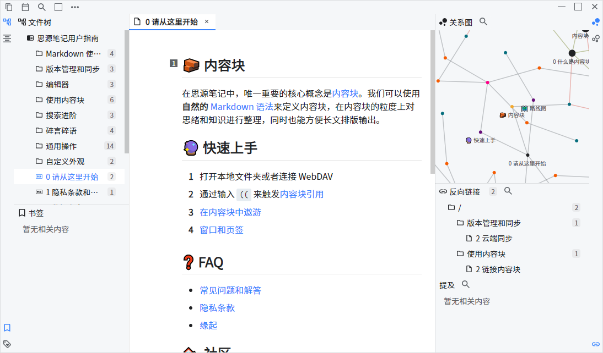

# Gitbook Theme for Siyuan

Gitbook style theme for [SiYuan](github.com/siyuan-note/siyuan): 

- based on default `daylight` theme with (subjective) modifications;
- bundled with `Noto Sans (思源黑体)` and `JetBrains Mono` as default fonts.

Reference: 

[Gitbook-Theme-for-Typora](https://github.com/16soundsofsilence/typora-gitbook-theme).

## Contributing & Troubleshooting

[New Issue](https://github.com/yuuuxt/siyuan-gitbook-azure/issues/new)